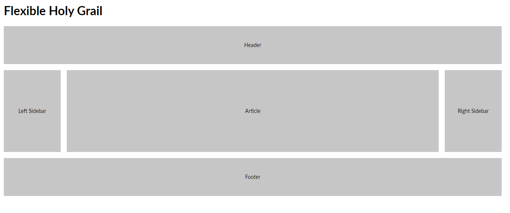
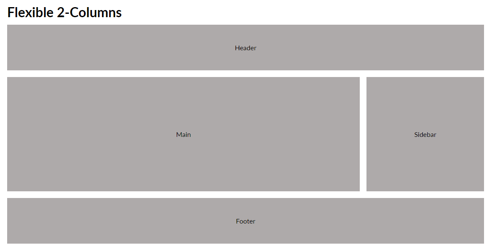
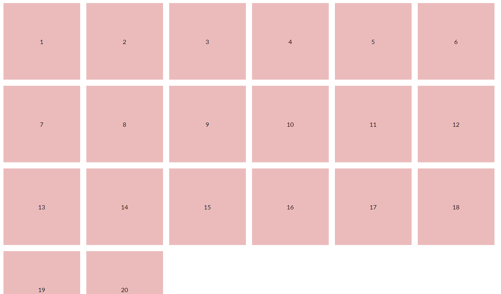

# CSS-Grid-Starter-Layouts

[January 16, 2021 - Begin]  
[January 17, 2021 - Readme Updated]  

This is a collection of starter templates for layouts and patterns using CSS Grid. 
The idea here is to show off what the technique is capable of doing and provide a starting point that can be re-purposed for other projects.

The classic three-column layout where two sidebars and a container holding the body copy is sandwiched between a full-width header and footer.

A classic blog layout where one column is for the post and the other for a sidebar.

          
<h4>Evenly Distributed, Fit as Needed</h4>

Elements flow into the layout and end when there are no more.

